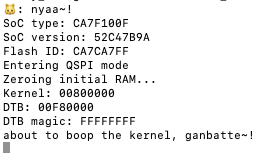

# Example ChipFlow design

This repository is the basis for our [Introduction to the ChipFlow platform](https://docs.chipflow.io/en/latest/tutorial-intro-chipflow-platform.html)
tutorial. 

## Preparing your local environment

 - [PDM must be installed](https://pdm-project.org/latest/#installation). 
 - [openFPGAloader is required](https://trabucayre.github.io/openFPGALoader/guide/install.html) to use a board.
   - macOS: Easiest way is `brew install openfpgaloader`.
   - Linux/Windows: Easiest way may be via the [OSS CAD Suite](https://github.com/YosysHQ/oss-cad-suite-build).
 - Clone this repository to your local environment.
 - Run `make init` to install the dependencies.

## Run the design in simulation

Build local simulation binary:

```bash
make sim-build
```

Build the software/BIOS which will run on our design.

```bash
make software-build
```

Now that we have our simulation and a BIOS, we can run it:

```bash
make sim-run
```

You should see something like this:



## Run the design on a ULX3S board

Build the design into a bitstream for the board:

```bash
make board-build
```

Build the bios, and program BIOS into the board's flash:

```bash
make software-build
make board-load-software-ulx3s
```

Load SoC onto board (program its bitstream):

```bash
make board-load-ulx3s
```

Your board should now be running. You can connect to it via its serial port:

### Connecting to your board on macOS

* Find the serial port for your board, using `ls /dev/tty.*` or `ls /dev/cu.*`. 
  You should see something like `/dev/tty.usbserial-K00219` for your board.
* Connect to the port via the screen utility, at baud 112200, with the command:
  `screen /dev/tty.usbserial-K00219 115200`.
* Now, press the `PWR` button on your board, which will restart the design.
* Within screen, should now see output like:
  
* To exit screen, use `CTRL-A`, then `CTRL-\`.


## Generate an RTLIL from your design

```bash
make silicon-rtlil
```

You should now have an `build/my_design.il`.

## Send your RTLIL to the API to prepare for manufacturing

```bash
make silicon-prepare
```
